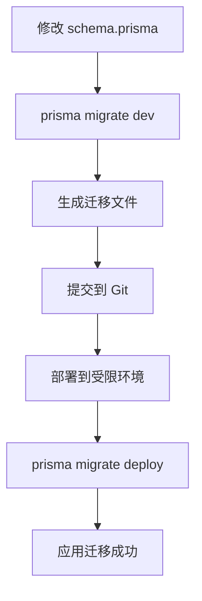

# Prisma Migrate Deploy 使用指南

> 在受限数据库用户环境下使用 Prisma 迁移

## 场景说明

当你遇到以下情况时,需要使用 `prisma migrate deploy` 而不是 `prisma migrate dev`:

1. **受限的数据库用户** - 没有创建/删除数据库的权限
2. **已有数据的数据库** - 数据库中已经存在其他表和数据
3. **生产环境部署** - 不能使用 `migrate dev` 或 `db push`

## 为什么不能用其他命令?

| 命令                    | 问题                                                 |
| ----------------------- | ---------------------------------------------------- |
| `prisma migrate dev`    | 需要创建 shadow database,受限用户可能无权限,不能使用 |
| `prisma db push`        | 会直接修改数据库结构,可能影响现有表和数据            |
| `prisma migrate deploy` | ✅ 只执行迁移脚本,不需要额外权限,安全可控            |

## ⚠️ 核心原则: 环境一致性

**最重要的工作流原则:**

1. **本地开发环境必须与生产环境的数据库版本一致**
   - 如果生产环境是 MySQL 5.6,本地也要用 MySQL 5.6
   - 如果生产环境是 MySQL 8.0,本地也要用 MySQL 8.0
   - 其余情况亦然
2. **为什么要保持一致?**
   - ❌ 不同 MySQL 版本生成的 SQL 语法可能不同
   - ❌ 不同版本的默认行为和特性支持不同 (如 `utf8mb4_0900_ai_ci` vs `utf8mb4_unicode_ci`)
   - ❌ 在本地生成的迁移脚本可能在生产环境执行失败
   - ✅ 保证迁移脚本的可靠性和可预测性

3. **正确的工作流:**

   ```bash
   # 1. 在本地开发环境(与生产环境相同版本的数据库)生成迁移
   pnpm prisma migrate dev --name your_migration_name

   # 2. 测试迁移脚本是否能正常执行

   # 3. 将迁移脚本提交到版本控制

   # 4. 在生产环境使用 migrate deploy 执行
   pnpm prisma migrate deploy
   ```

## 两种典型场景

### 场景 A: 数据库已有 Prisma 的表结构

**情况描述:**

- 数据库中已经存在 Prisma schema 定义的所有表
- 可能通过 `db push` 或手动创建的
- 现在想切换到 Prisma Migrate 管理

**解决方案:** 使用 Baseline 方式(见下方详细步骤)

### 场景 B: 数据库是全新的或只有其他业务的表

**情况描述:**

- 数据库中有其他业务的表和数据(不能删除)
- **但是没有 Prisma schema 中定义的任何表**
- 需要将 Prisma 模型首次同步到这个数据库
- 数据库用户权限受限,不能创建 shadow database

#### 解决方案: 在本地生成初始迁移,然后在目标环境执行

#### 步骤 1: 配置本地开发环境 (可选)

如果你的目标环境是旧版本 MySQL（如 5.6），建议修改本地 Docker 配置以保持一致：

##### 示例：将 MySQL 版本改为 5.6

```yaml
# docker-compose.dev.yml (示例配置)
version: '3.8'

name: enterprise-dev

services:
  mysql:
    # 原配置: image: mysql:8.0
    # 改为旧版本以匹配目标环境:
    image: mysql:5.6 # ⭐ 修改这里

    container_name: enterprise-mysql-dev
    restart: unless-stopped
    environment:
      MYSQL_ROOT_PASSWORD: password
      MYSQL_DATABASE: enterprise_db
      MYSQL_USER: app_user
      MYSQL_PASSWORD: app_password
      TZ: Asia/Shanghai
    ports:
      - '3306:3306'
    volumes:
      - mysql_data:/var/lib/mysql
      - ./docker/mysql/init.sql:/docker-entrypoint-initdb.d/init.sql:ro
    # MySQL 5.6 使用 utf8mb4_unicode_ci 排序规则
    command: --character-set-server=utf8mb4 --collation-server=utf8mb4_unicode_ci
    healthcheck:
      test: ['CMD', 'mysqladmin', 'ping', '-h', 'localhost']
      timeout: 20s
      retries: 10

  redis:
    image: redis:7-alpine
    container_name: enterprise-redis-dev
    restart: unless-stopped
    ports:
      - '6379:6379'
    volumes:
      - redis_data:/data
    command: redis-server --appendonly yes --maxmemory 256mb --maxmemory-policy allkeys-lru

volumes:
  mysql_data:
  redis_data:

networks:
  default:
    name: enterprise-dev-network
```

##### 关键配置说明

| 配置项       | MySQL 8.0               | MySQL 5.6               | 说明            |
| ------------ | ----------------------- | ----------------------- | --------------- |
| 镜像版本     | `mysql:8.0`             | `mysql:5.6`             | 主要区别        |
| 默认排序规则 | `utf8mb4_0900_ai_ci`    | `utf8mb4_unicode_ci`    | 5.6 不支持 0900 |
| JSON 类型    | 原生支持                | 不支持                  | 5.6 需用 TEXT   |
| 认证插件     | `caching_sha2_password` | `mysql_native_password` | 可能需要指定    |

##### 如果遇到连接认证问题 (MySQL 5.6)

```yaml
# 在 command 中添加认证方式
command: >
  --character-set-server=utf8mb4
  --collation-server=utf8mb4_unicode_ci
  --default-authentication-plugin=mysql_native_password
```

**注意:** 本项目当前使用 MySQL 5.6，如果你的目标环境是其他版本，请相应调整。

#### 步骤 2: 本地生成初始迁移

```bash
# 1. 启动本地数据库（确保版本与目标环境一致）
docker-compose -f docker-compose.dev.yml up -d mysql

# 2. 等待数据库完全启动
docker-compose -f docker-compose.dev.yml logs -f mysql
# 看到 "ready for connections" 后按 Ctrl+C 退出

# 3. 确保本地数据库是全新的(或删除 Prisma 相关的表)
# 可以重新创建数据库或手动删除表

# 4. 生成初始迁移
pnpm prisma migrate dev --name init

# 5. 这会生成 prisma/migrations/[timestamp]_init/migration.sql
# 这个 SQL 文件包含了所有 Prisma 表的 CREATE TABLE 语句
```

#### 步骤 3: 在目标数据库执行迁移

```bash
# 1. 检查生成的 migration.sql 文件
# prisma/migrations/[timestamp]_init/migration.sql

# 2. 连接到目标数据库(已有其他业务表的数据库)

# 3. 先创建 _prisma_migrations 表
```

```sql
CREATE TABLE IF NOT EXISTS `_prisma_migrations` (
  `id` VARCHAR(36) NOT NULL,
  `checksum` VARCHAR(64) NOT NULL,
  `finished_at` DATETIME(3) NULL,
  `migration_name` VARCHAR(255) NOT NULL,
  `logs` TEXT NULL,
  `rolled_back_at` DATETIME(3) NULL,
  `started_at` DATETIME(3) NOT NULL DEFAULT CURRENT_TIMESTAMP(3),
  `applied_steps_count` INT UNSIGNED NOT NULL DEFAULT 0,
  PRIMARY KEY (`id`)
) ENGINE=InnoDB DEFAULT CHARSET=utf8mb4 COLLATE=utf8mb4_unicode_ci;
```

```bash
# 4. 手动执行 migration.sql 中的所有 CREATE TABLE 语句
# ⚠️ 只会创建 Prisma 的表,不会影响数据库中已有的其他表

# 5. 验证表是否创建成功
```

```sql
SHOW TABLES; -- 应该看到 Prisma 的表和原有的其他表都在
```

#### 步骤 3: 标记迁移为已完成

```bash
# 1. 计算 checksum
pnpm tsx scripts/tools/calculate-migration-checksum.ts [timestamp]_init

# 2. 插入迁移记录
```

```sql
INSERT INTO `_prisma_migrations`
  (`id`, `checksum`, `finished_at`, `migration_name`, `logs`, `started_at`, `applied_steps_count`)
VALUES
  (UUID(), '你计算出的checksum', NOW(3), '[timestamp]_init', NULL, NOW(3), 1);
```

#### 步骤 4: 验证设置

```bash
# 在目标环境执行
pnpm prisma migrate deploy

# 如果输出: "No pending migrations to apply."
# 说明 baseline 设置成功! ✅
```

**后续工作流:**

```bash
# 1. 在本地开发环境修改 schema.prisma

# 2. 生成新的迁移
pnpm prisma migrate dev --name add_new_field

# 3. 提交迁移文件到版本控制

# 4. 在目标环境部署
pnpm prisma migrate deploy
# 这会自动执行新的迁移,不影响其他表 ✅
```

**关键点:**

- ✅ 只创建 Prisma 定义的表,不会修改或删除其他表
- ✅ 使用与目标环境相同的数据库版本生成迁移
- ✅ 手动执行迁移可以先验证 SQL 语句
- ✅ 后续可以正常使用 `migrate deploy` 管理迁移

## 场景 A 详细步骤: Migrate Deploy + Baseline

### 步骤 1: 设置 Baseline (初次设置)

当你的数据库已经存在 Prisma 的表结构时,需要设置 baseline:

#### 1.1 确保 schema.prisma 与数据库结构一致

```bash
# 确保你的 schema.prisma 与目标数据库当前结构一致
```

#### 1.2 创建 \_prisma_migrations 表

```sql
-- 连接到 MySQL 数据库执行:
CREATE TABLE IF NOT EXISTS `_prisma_migrations` (
  `id` VARCHAR(36) NOT NULL,
  `checksum` VARCHAR(64) NOT NULL,
  `finished_at` DATETIME(3) NULL,
  `migration_name` VARCHAR(255) NOT NULL,
  `logs` TEXT NULL,
  `rolled_back_at` DATETIME(3) NULL,
  `started_at` DATETIME(3) NOT NULL DEFAULT CURRENT_TIMESTAMP(3),
  `applied_steps_count` INT UNSIGNED NOT NULL DEFAULT 0,
  PRIMARY KEY (`id`)
) ENGINE=InnoDB DEFAULT CHARSET=utf8mb4 COLLATE=utf8mb4_unicode_ci;
```

#### 1.3 **⚠️ 重要: 手动执行所有迁移脚本**

在标记迁移为已完成之前,**必须先手动执行迁移脚本**:

```bash
# 1. 依次打开每个迁移文件
# prisma/migrations/20251018030905_init_databases/migration.sql
# prisma/migrations/20251021135306_remove_foreign_keys/migration.sql
# prisma/migrations/20251022121012_change_tables_primary_key_id_to_uuid/migration.sql

# 2. 将每个 migration.sql 中的 SQL 语句复制到 MySQL 客户端中执行
# 3. 确认每个迁移都执行成功,没有报错
# 4. 验证数据库结构是否符合预期
```

**为什么要手动执行?**

- ✅ 可以逐步验证每个迁移是否与现有数据库兼容
- ✅ 遇到问题可以立即发现并调整
- ✅ 避免 `prisma migrate deploy` 执行到一半失败
- ✅ 对于已有数据的表,可以先备份再操作

**执行顺序非常重要:**

```bash
# 按时间戳顺序执行,不能跳过或乱序
1. 20251018030905_init_databases
2. 20251021135306_remove_foreign_keys
3. 20251022121012_change_tables_primary_key_id_to_uuid
```

#### 1.4 获取正确的 checksum

```bash
# ⚠️ 重要: checksum 不能随便填写!
# Prisma 会校验 checksum 与迁移文件内容是否匹配

# 使用提供的工具计算 checksum
pnpm tsx scripts/tools/calculate-migration-checksum.ts --all

# 或者计算单个迁移的 checksum
pnpm tsx scripts/tools/calculate-migration-checksum.ts 20251018030905_init_databases
```

#### 1.5 标记迁移为已应用

**只有在手动执行成功后才能标记!**

```sql
-- ⚠️ 注意: 以下 checksum 值是根据实际迁移文件计算得出的
-- 请使用 calculate-migration-checksum.ts 脚本获取当前项目的实际值

-- 标记 init_databases 迁移为已应用
INSERT INTO `_prisma_migrations`
  (`id`, `checksum`, `finished_at`, `migration_name`, `logs`, `started_at`, `applied_steps_count`)
VALUES
  (UUID(), '997fbfc1c6a3f822ded3236e4105fbbdd1d7fda15a2171f7b06dc0324e73d1e8', NOW(3), '20251018030905_init_databases', NULL, NOW(3), 1);

-- 标记 remove_foreign_keys 迁移为已应用
INSERT INTO `_prisma_migrations`
  (`id`, `checksum`, `finished_at`, `migration_name`, `logs`, `started_at`, `applied_steps_count`)
VALUES
  (UUID(), 'aa32a933a3eb09d1dd019a2fbde7cad5c55adc978899ddb3c09cd1f352f8589a', NOW(3), '20251021135306_remove_foreign_keys', NULL, NOW(3), 1);

-- 标记 change_tables_primary_key_id_to_uuid 迁移为已应用
INSERT INTO `_prisma_migrations`
  (`id`, `checksum`, `finished_at`, `migration_name`, `logs`, `started_at`, `applied_steps_count`)
VALUES
  (UUID(), '366aa56250b0be0e12d76c21a756ea2c53ff1635e3262320471b94327549fc75', NOW(3), '20251022121012_change_tables_primary_key_id_to_uuid', NULL, NOW(3), 1);
```

**验证标记是否成功:**

```sql
SELECT migration_name, finished_at FROM `_prisma_migrations` ORDER BY started_at;
```

### 步骤 2: 执行迁移部署

设置好 baseline 后,就可以使用 `migrate deploy` 了:

```bash
# 执行所有未应用的迁移
pnpm prisma migrate deploy

# 或使用完整命令
npx prisma migrate deploy
```

**命令说明:**

- 只会执行 `_prisma_migrations` 表中没有记录的迁移
- 不需要 shadow database
- 不需要特殊数据库权限
- 安全,不会影响现有数据

### 步骤 3: 后续开发流程

#### 3.1 在开发环境创建新迁移

```bash
# 修改 schema.prisma 后
pnpm prisma migrate dev --name your_migration_name

# 这会:
# 1. 在 prisma/migrations/ 下创建新的迁移文件
# 2. 在开发数据库中执行迁移
# 3. 重新生成 Prisma Client
```

#### 3.2 在受限环境应用新迁移

```bash
# 1. 提交代码,包含新的迁移文件
git add prisma/migrations/
git commit -m "feat: add new migration"
git push

# 2. 在受限环境拉取代码
git pull

# 3. 执行迁移部署
pnpm prisma migrate deploy
```

## MySQL 5.6 特殊配置

### Docker Compose 配置

```yaml
services:
  mysql:
    image: mysql:5.6
    environment:
      MYSQL_ROOT_PASSWORD: password
      MYSQL_DATABASE: enterprise_db
      MYSQL_USER: app_user
      MYSQL_PASSWORD: app_password
    command: --character-set-server=utf8mb4 --collation-server=utf8mb4_unicode_ci
```

**注意事项:**

- MySQL 5.6 不支持 `default-time-zone` 参数
- 移除了 `default-authentication-plugin` (5.7+ 特性)
- 确保使用 `utf8mb4` 字符集

### Prisma Schema 配置

```prisma
datasource db {
  provider     = "mysql"
  url          = env("DATABASE_URL")
  relationMode = "prisma" // 重要: MySQL 5.6 可能需要此设置
}
```

## Checksum 详解

### 什么是 Checksum?

Checksum (校验和) 是 Prisma 用来验证迁移文件完整性的机制。它是一个基于迁移文件内容计算出的 **SHA256 哈希值**。

### Checksum 的作用

1. **防止篡改**: 确保迁移文件在传输或存储过程中没有被修改
2. **一致性验证**: 保证团队成员使用的是相同版本的迁移文件
3. **完整性检查**: 检测迁移文件是否损坏或不完整

### Checksum 的生成逻辑

```javascript
// Prisma 内部使用类似以下逻辑计算 checksum
const crypto = require('crypto');
const fs = require('fs');

function calculateChecksum(migrationFilePath) {
  const content = fs.readFileSync(migrationFilePath, 'utf8');
  return crypto.createHash('sha256').update(content, 'utf8').digest('hex');
}
```

**关键点:**

- 算法: SHA256
- 输入: 迁移文件的完整文本内容 (包括所有空格、换行)
- 输出: 64 位十六进制字符串

### 校验时机

Prisma 会在以下情况下校验 checksum:

1. **执行 `prisma migrate deploy`**: 对比数据库中记录的 checksum 和文件的实际 checksum
2. **执行 `prisma migrate dev`**: 检查现有迁移是否被修改
3. **执行 `prisma migrate status`**: 验证迁移历史的完整性

### ⚠️ 为什么不能随便填写?

```sql
-- ❌ 错误示例: 随便填写 checksum
INSERT INTO `_prisma_migrations` (id, checksum, ...)
VALUES (UUID(), 'random_checksum_123', ...);

-- 后果:
-- 1. prisma migrate deploy 会报错: checksum mismatch
-- 2. prisma migrate status 显示迁移已损坏
-- 3. 无法继续进行数据库迁移
```

**错误信息示例:**

```text
Error: P3005 The database schema is not in sync with the migration history.

The following migration(s) have a checksum mismatch:
  - 20251018030905_init_databases
```

### 如何获取正确的 Checksum?

#### 方法一: 使用提供的计算工具 (推荐)

```bash
# 计算所有迁移的 checksum
pnpm tsx scripts/tools/calculate-migration-checksum.ts --all

# 计算单个迁移的 checksum
pnpm tsx scripts/tools/calculate-migration-checksum.ts 20251018030905_init_databases
```

工具会输出:

- 迁移名称
- 正确的 checksum 值
- 可直接使用的 SQL 插入语句

#### 方法二: 使用 Node.js 手动计算

```javascript
const crypto = require('crypto');
const fs = require('fs');

const migrationFile =
  'prisma/migrations/20251018030905_init_databases/migration.sql';
const content = fs.readFileSync(migrationFile, 'utf8');
const checksum = crypto
  .createHash('sha256')
  .update(content, 'utf8')
  .digest('hex');

console.log(checksum);
// 输出: 997fbfc1c6a3f822ded3236e4105fbbdd1d7fda15a2171f7b06dc0324e73d1e8
```

#### 方法三: 使用命令行工具

```bash
# Linux/Mac
shasum -a 256 prisma/migrations/20251018030905_init_databases/migration.sql

# Windows PowerShell
Get-FileHash -Algorithm SHA256 prisma\migrations\20251018030905_init_databases\migration.sql
```

### Checksum 不匹配的处理

如果遇到 checksum 不匹配的错误:

1. **确认迁移文件是否被修改**

   ```bash
   git diff prisma/migrations/
   ```

2. **重新计算正确的 checksum**

   ```bash
   pnpm tsx scripts/tools/calculate-migration-checksum.ts <migration_name>
   ```

3. **更新数据库中的记录**

   ```sql
   UPDATE `_prisma_migrations`
   SET `checksum` = '新的正确checksum值'
   WHERE `migration_name` = '迁移名称';
   ```

4. **或者删除记录重新执行**

   ```sql
   DELETE FROM `_prisma_migrations`
   WHERE `migration_name` = '迁移名称';
   ```

   然后重新执行 `prisma migrate deploy`

### Checksum 最佳实践

✅ **推荐:**

- 使用提供的工具计算 checksum
- 始终验证 checksum 的正确性
- 不要手动修改已应用的迁移文件

❌ **避免:**

- 随意填写 checksum 值
- 修改已提交的迁移文件
- 在生产环境直接修改 `_prisma_migrations` 表

## 常见问题

### Q1: 如何查看当前已应用的迁移?

```sql
SELECT * FROM `_prisma_migrations` ORDER BY `started_at` DESC;
```

### Q2: 如何重置迁移状态?

```sql
-- ⚠️ 危险操作! 仅在开发环境使用
TRUNCATE TABLE `_prisma_migrations`;
```

### Q3: 迁移失败后如何处理?

```bash
# 1. 检查失败原因
pnpm prisma migrate deploy

# 2. 查看迁移状态
pnpm prisma migrate status

# 3. 手动修复数据库问题后,标记为已应用
# 或删除失败的迁移记录,重新执行
```

### Q4: 如何跳过某个迁移?

```sql
-- 手动插入记录标记为已应用
INSERT INTO `_prisma_migrations`
  (`id`, `checksum`, `finished_at`, `migration_name`, `logs`, `started_at`, `applied_steps_count`)
VALUES
  (UUID(), '', NOW(3), 'MIGRATION_NAME_TO_SKIP', 'Manually skipped', NOW(3), 0);
```

## 最佳实践

### ✅ 推荐做法

1. **始终在开发环境测试迁移** - 使用 `migrate dev` 创建和测试
2. **使用语义化命名** - 迁移名称应清晰描述改动
3. **审查生成的 SQL** - 检查 `migration.sql` 文件
4. **版本控制迁移文件** - 所有迁移都应提交到 Git
5. **记录重要迁移** - 在 CHANGELOG 中记录破坏性变更

### ❌ 避免做法

1. **不要手动修改已应用的迁移文件** - 会导致 checksum 不匹配
2. **不要直接修改数据库结构** - 应通过迁移管理
3. **不要在生产环境使用 `db push`** - 可能丢失数据
4. **不要删除已应用的迁移文件** - 会导致历史记录丢失

## 工作流总结



## 相关命令速查

```bash
# 查看迁移状态
pnpm prisma migrate status

# 执行迁移部署
pnpm prisma migrate deploy

# 创建新迁移 (开发环境)
pnpm prisma migrate dev --name migration_name

# 重置数据库 (仅开发环境)
pnpm prisma migrate reset

# 生成 Prisma Client
pnpm prisma generate

# 打开数据库管理界面
pnpm prisma studio
```

## 参考资料

- [Prisma Migrate 官方文档](https://www.prisma.io/docs/concepts/components/prisma-migrate)
- [Baseline 设置指南](https://www.prisma.io/docs/guides/migrate/developing-with-prisma-migrate/baselining)
- [生产环境迁移](https://www.prisma.io/docs/guides/migrate/production-troubleshooting)

---

**维护者**: XSIJIE
**更新时间**: 2025-10-22
